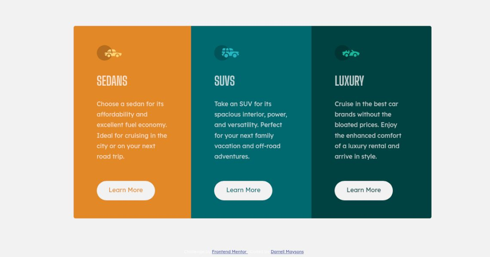

# Frontend Mentor - 3-column preview card component solution

This is a solution to the [3-column preview card component challenge on Frontend Mentor](https://www.frontendmentor.io/challenges/3column-preview-card-component-pH92eAR2-). Frontend Mentor challenges help you improve your coding skills by building realistic projects.

## Table of contents

- [Overview](#overview)
  - [The challenge](#the-challenge)
  - [Screenshot](#screenshot)
  - [Links](#links)
- [My process](#my-process)
  - [Built with](#built-with)
  - [What I learned](#what-i-learned)
  - [Resources](#resources)
- [Author](#author)

## Overview

### The challenge

Users should be able to:

- View the optimal layout depending on their device's screen size
- See hover states for interactive elements

### Screenshot - Desktop



### Links

- Solution URL: [https://practical-einstein-36d417.netlify.app/](https://practical-einstein-36d417.netlify.app/)
- Live Site URL: [https://practical-einstein-36d417.netlify.app/](https://practical-einstein-36d417.netlify.app/)

## My process

Place provided design images in Figma to rough out block element sizes and spatial relationships.

Edit the 'index.html' file to ensure correct markup. Revisit this once I've decided initial approach to styling/layou and add any class or IDs needed.

Create CSS partials for colors, typography etc

Start styling from top-down. Check rendors and use WebDev browser tools to identify issues or tweak values.

### Built with

- Semantic HTML5 markup
- CSS custom properties
- Flexbox
- Desktop-first workflow
- SASS - For styles
- Figma - For assessing design

### What I learned

Positioning using Flex is still a largely undiscovered country for me. Positioning elements in general remains one of my greatest challenges. I feel I am making good progress though and am happy with the overall outcome.

This was my first project using SASS and the SASS compiler Visual Studio Code extension. It was also the first time I have incorporated partials for my CSS to improve modularity and ease of maintenance. For the same reason I also used variables for colors.

I've never coded SVGs but found this pretty straigh forward as it turned out (just drop the code into my document!)

The following is an example of my use of CSS variables for colors...

```css
// colors
$first-card-bg: hsl(31, 77%, 52%)
$second-card-bg: hsl(184, 100%, 22%)
$third-card-bg: hsl(179, 100%, 13%)
$transparent-white: hsla(0, 0%, 100%, 0.75) //paragraphs
$very-light-gray: hsl(0, 0%, 95%) //(background, headings, buttons)
```

...and CSS partials.

```css
@import helpers;
@import typography;
```

## Resources

W3Schools [https://www.w3schools.com](W3Slink). Invaluable!
CSS Tricks [https://css-tricks.com](CSSTricksHome). Again, invaluable!

## Author

- Frontend Mentor - [@monkeysh1ne](https://www.frontendmentor.io/profile/yourusername)

[](https://app.netlify.com/sites/practical-einstein-36d417/deploys)
